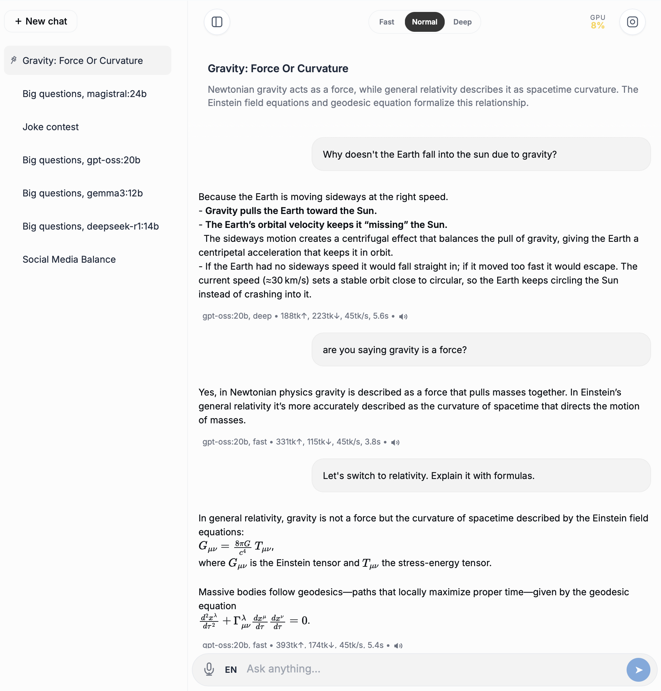
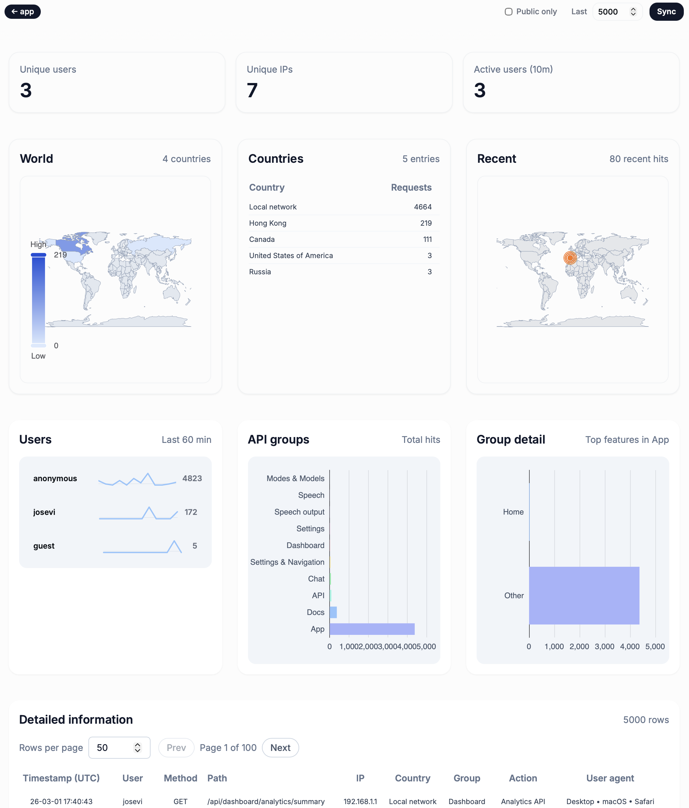
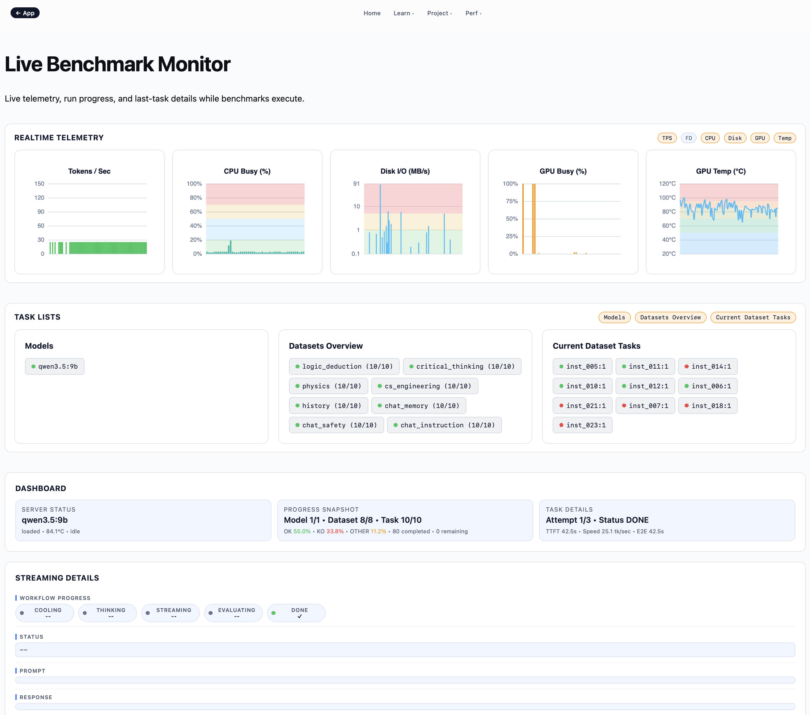

# Local Chat + Benchmark

Local-first chat app (Flask + vanilla JS + Ollama) with an integrated benchmark framework and benchmark monitor monitor.
The app is running on https://josevi.ddns.net

## Screenshots

### Chat app



### Dashboard module



### Benchmarking module



## Product Tour Video

<p align="center">
  iPhone walkthrough of chat, dashboard, and benchmarking flows.
  <br/>
  <a href="https://youtube.com/shorts/EI52n5I_2AE">Watch on YouTube Shorts</a>
</p>

## What this repo includes

- Chat app with auth, session history, STT/TTS support, and admin dashboard
- Benchmark runner with canonical dataset/config pipeline
- Live benchmark page for real-time run monitoring
- Documentation set under `/docs`

## Requirements (macOS)

- Python 3.11+
- Ollama
- Homebrew
- Optional: `caddy` (HTTPS), `espeak-ng` (server TTS)

Install base dependencies:

```bash
brew install python@3.11 jq
```

Optional:

```bash
brew install caddy espeak-ng
```

## Setup

Clone the repository and enter the project folder:

```bash
git clone <your-repo-url>
cd <repo-folder>
python3 -m venv chat_env
./chat_env/bin/pip install --upgrade pip
./chat_env/bin/pip install -r requirements.txt
```

Pull at least one model:

```bash
ollama pull gemma3:4b
```

## Run the app

```bash
./scripts/run.sh start
```

Useful commands:

```bash
./scripts/run.sh status
./scripts/run.sh stop
./scripts/run.sh restart
```

Open:

- App: `http://127.0.0.1:4200`
- Docs index: `http://127.0.0.1:4200/docs/`

## Run benchmark

Canonical benchmark config:

```bash
./chat_env/bin/python benchmark/run_benchmark.py --config benchmark/config_full.yaml
```

Outputs:

- Report: `static/docs/benchmark_guided.html`
- Live monitor: `http://127.0.0.1:4200/static/docs/benchmark_monitor.html`

## Data files shared in repo

`db/` intentionally includes:

- `db/benchmark.db` (curated benchmark run data)
- `db/GeoLite2-Country.mmdb` + license files

## Project structure

- `app.py` - Flask app bootstrap
- `src/` - API routes and core services
- `static/` - UI, JS, CSS, docs pages
- `benchmark/` - benchmark runner, tasks, evaluators, configs, datasets
- `scripts/` - operational helper scripts
- `db/` - shared local data files used by app/benchmark

## License

PolyForm Noncommercial 1.0.0.
